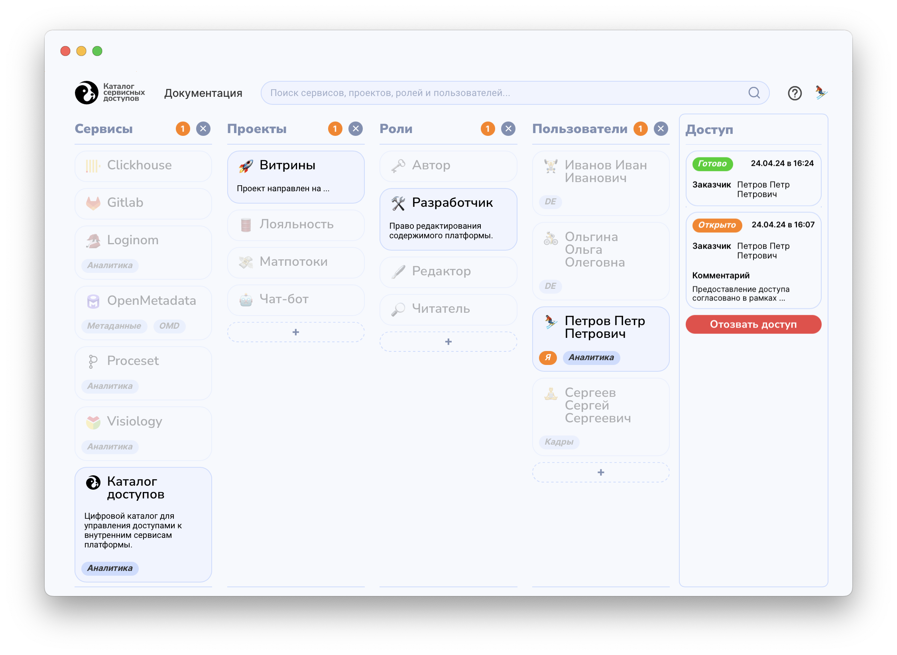

# **Каталог сервисных доступов**


<br>
Графический интерфейс для модерирования процесса выдачи доступов. Основной экран представляет из себя 4 колонки – сущности доступа: 
- сервисы, 
- проекты, 
- роли, 
- пользователи;

Установка пакета производится следующим образом:
```sh
pip install git+https://github.com/dsp-shp/access-catalog.git
```

### **Структура репозитория**
- ```access_catalog/``` - директория, содержащая всю функциональную часть (итоговый python-пакет)
    - ```assets``` - CSS-компоненты
    - ```connection``` - коннекторы к базе
    - ```static``` - медиа-файлы
    - ```scripts``` - JS-компоненты
    - ```views``` - страницы
        - ```__init__.py``` - общие для всех страниц компоненты
        - ```home.py``` - код основного экрана
        - ```login.py``` - код страницы авторизации
    - ```config.yaml``` - конфигурационный файл
    - ```run.py``` - скрипт запуска веб-интерфейса
    - ```sample.json``` - сэпмл данных для инициализации базы
- ```Dockerfile``` - компонент контейнеризации
- ```info.json```, ```requirements.txt```, ```setup.py``` - копоменты установки

